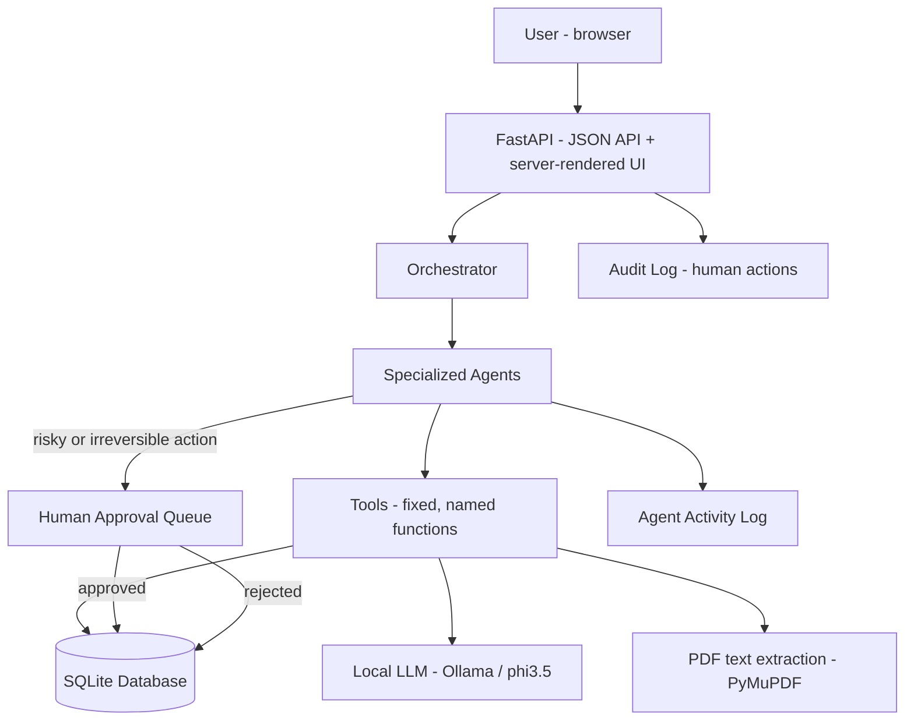
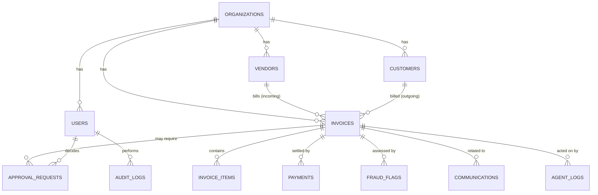
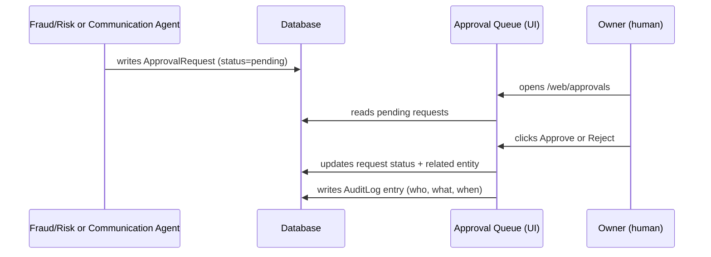

# Architecture

## System flow

Every write that an agent proposes and that is financially risky or externally visible (a high-risk invoice, sending a communication) is routed through the **Human Approval Queue** before it takes effect — never executed directly by an agent. Every agent step is recorded in **Agent Activity**; every human action (create/edit/delete an invoice, approve/reject a request) is recorded in the **Audit Log**. These are two different logs on purpose: one is "what did AI decide," the other is "what did a person do."

## LLM vs. Agent vs. Tool vs. Workflow vs. Orchestrator

A recurring mistake in AI-labeled projects is calling every component "an agent." This project draws the line explicitly:

| Term | What it means here | Example in this codebase |
|---|---|---|
| **LLM call** | One prompt in, one structured/text response out. No memory, no tools, no decision-making of its own. | `llm_extraction_service.extract_invoice_with_llm()` — text in, JSON out, nothing else |
| **Tool** | A plain, deterministic function an agent is allowed to call by name. Never raw SQL, never arbitrary code. | `app/tools/invoice_tools.py` — `search_invoices()`, `check_duplicate_invoice()` |
| **Agent** | A component with a goal, that uses an LLM call as ONE step, reasons over the result, and decides an action — with an explicit, documented boundary between what the LLM decides and what deterministic code decides. | `app/agents/fraud_risk_agent.py` — the risk *score* is 100% deterministic Python; the LLM's only job is turning that score into an explanation sentence |
| **Workflow** | A fixed, predetermined sequence of steps. Not agentic — no judgment is exercised about *which* steps run. | Invoice creation always runs Fraud/Risk Agent then Classification Agent, in that fixed order |
| **Orchestrator** | Routes a request to the relevant agent(s) and sequences/logs the result. Routing here is currently rule-based (by request type), not LLM-planned — see Future Work. | `app/agents/orchestrator.py` |

Each agent's own docstring states this breakdown for that specific agent — see `app/agents/*.py`.

## Database entities

## Human-in-the-loop approval flow

No agent can move a request from `pending` to `approved` — that transition only happens inside the route handler triggered by an authenticated owner's click (`app/web/routes.py::_decide_approval`, gated by `Depends(require_owner)`).
